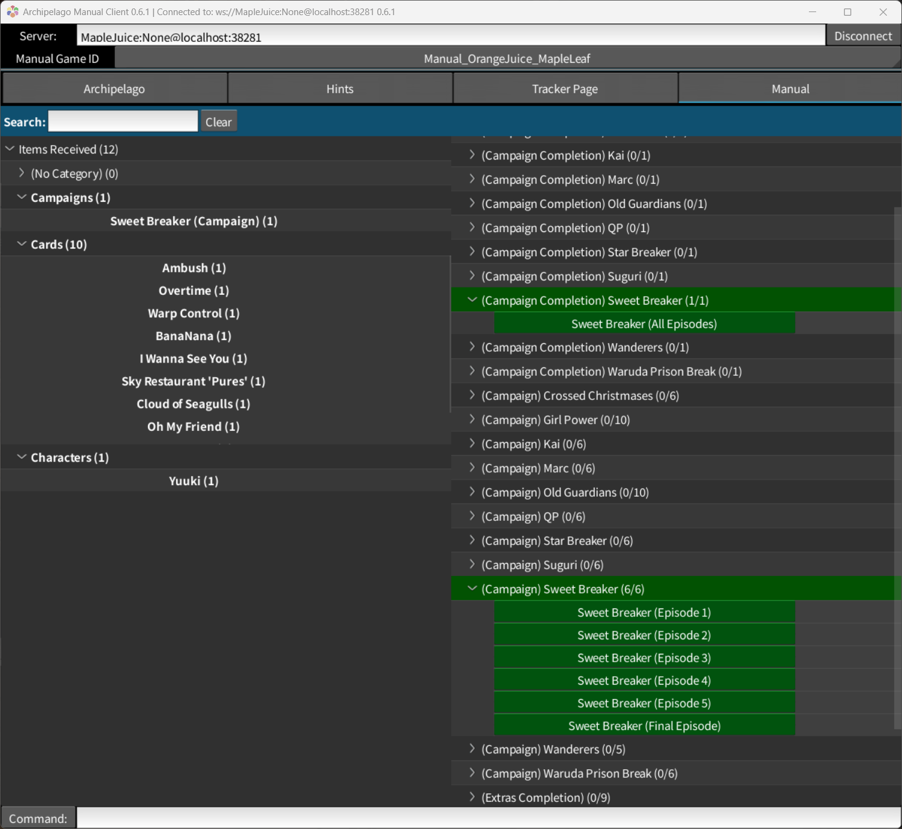

# Archipelago Manual for 100% Orange Juice 🍊

[Download from Releases](https://github.com/itsMapleLeaf/manual-oj/releases/latest)

> TODO: player guide

The YAML template (generated by the "Generate Template Options" button in the AP launcher) will contain several options for enabling or disabling certain DLCs for completion.

For disabling individual characters or cards, for now, disable them via the built-in AP YAML options.

## Development

The source content is defined at `src/data/content.json`, and the world data is generated dynamically from that.

Run `python -m scripts.build` to generate the world.

By default, it generates the world directly into the default Archipelago custom_worlds path on Windows. You can configure that by copying `.env.example` to `.env` and changing the `OUTPUT_PATH` variable.
